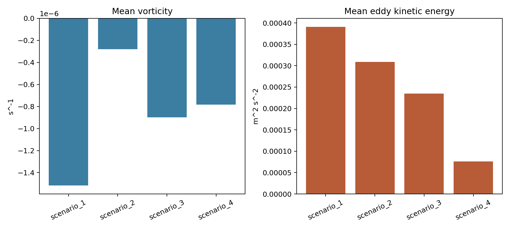
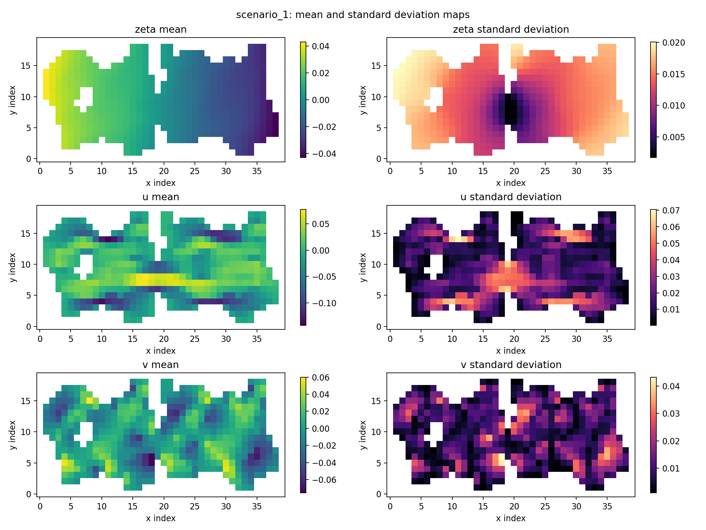
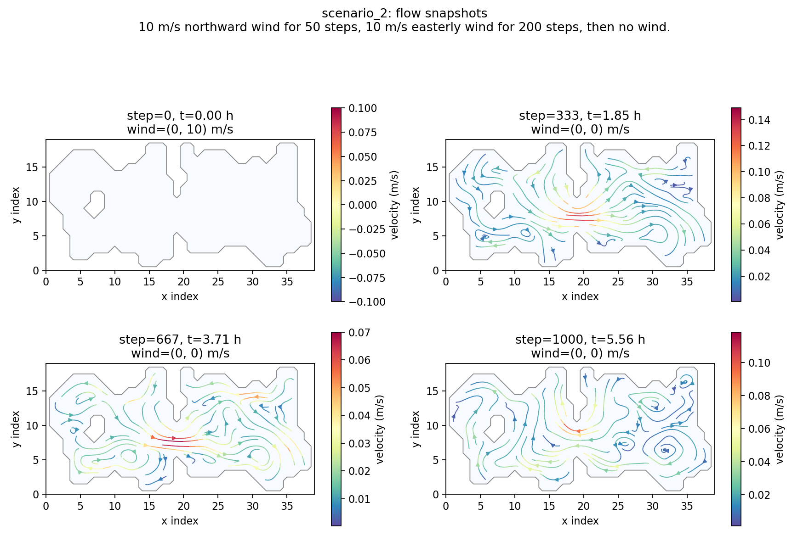
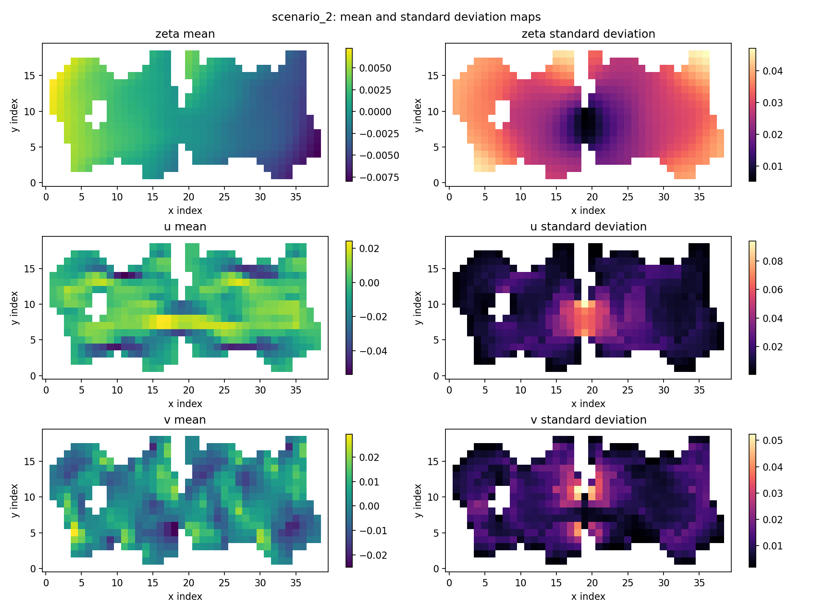
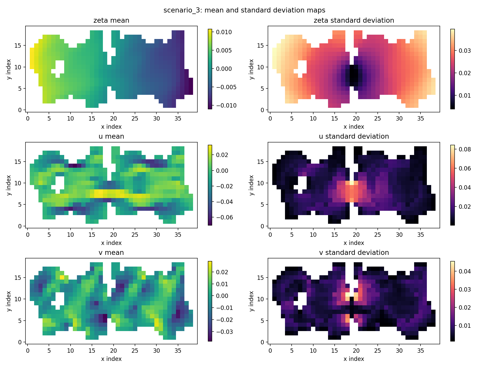
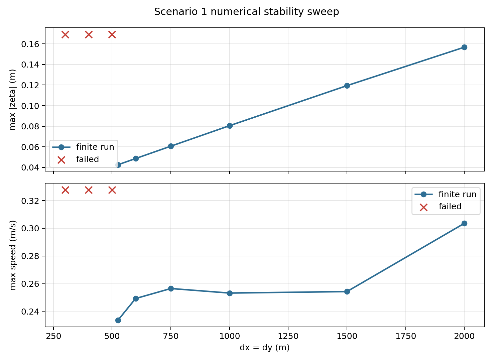
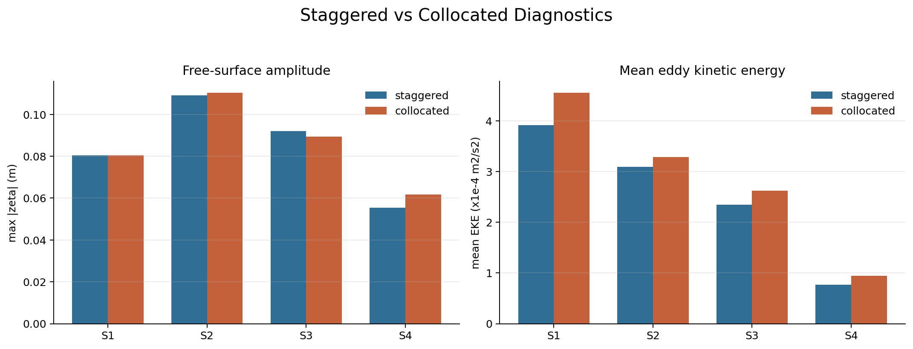

# SWE Lake Model

This project simulates wind-driven circulation in an enclosed lake using the linearized shallow water equations on the supplied bathymetry grid. The model evolves free-surface displacement `zeta` and depth-integrated transports `U` and `V`.

## Lake Setup


## Scenarios

| Scenario | Wind forcing | Geometry |
| --- | --- | --- |
| `scenario_1` | Constant easterly wind: `WX = -10 m/s`, `WY = 0` | Original lake |
| `scenario_2` | `WY = 10 m/s` for 50 steps, then `WX = -10 m/s` for 200 steps, then calm | Original lake |
| `scenario_3` | `WX = -10 m/s`, `WY = -5 m/s` for 50 steps, then `WX = -10 m/s` for 200 steps, then calm | Original lake |
| `scenario_4` | Same wind forcing as `scenario_3` | Artificial land barrier at the middle x-index |

Positive `WX` points eastward and positive `WY` points northward.

## Physical Model

The model uses a depth-averaged shallow-water formulation. The prognostic variables are:

- $\zeta$: free-surface displacement relative to the initial lake level
- $U$: depth-integrated transport in the x direction
- $V$: depth-integrated transport in the y direction
- $H$: still-water depth from the bathymetry grid


## Numerical Pipeline

The default solver uses a staggered grid: `zeta` and `H` are stored at cell centers, while `U` and `V` are stored on x- and y-facing cell faces. The collocated mode is also available through `--grid-mode collocated`.

For each time step, the default staggered solver advances the state in this order:

1. Compute face-centered `dzeta/dx` and `dzeta/dy` from neighboring wet cells.
2. Compute quadratic bottom drag from the current transports.
3. Evaluate the wind-stress and Coriolis terms.
4. Update face-centered `U` and `V` with explicit Euler time stepping.
5. Set outer-boundary and wet-land face transports to zero.
6. Compute transport divergence directly from face differences.
7. Update `zeta` with explicit Euler time stepping.

The default grid and time settings are:

$$
\Delta x = 1000\ \mathrm{m}, \qquad
\Delta y = 1000\ \mathrm{m}, \qquad
\Delta t = 20\ \mathrm{s}, \qquad
N_\mathrm{steps} = 1000.
$$

Wind changes are defined by model step index.

## Assumptions

- The model is depth-averaged, so it does not resolve vertical shear, surface Ekman flow, or separate bottom return flow.
- Land cells have `H = 0` and are permanently dry because no land elevation is provided.
- Land behaves like an impermeable barrier; the model does not include wetting and drying.
- Water-land and outer-domain faces use closed-boundary conditions with zero normal transport flux.
- Surface gradients are computed only through connected wet cells, so land is not treated as water with `zeta = 0`.
- Bottom effects are represented by the bathymetry and a simplified quadratic drag term.

## Run

Create and activate a conda environment:

```bash
conda create -n swe-lake python=3.11
conda activate swe-lake
python -m pip install -r requirements.txt
```

Run all scenarios with the default staggered grid and generate data, summary tables, and figures:

```bash
python -m src.run_all --grid-mode staggered
```

Run both grid arrangements into separate output folders:

```bash
python -m src.run_all --grid-mode staggered --output-dir outputs/staggered
python -m src.run_all --grid-mode collocated --output-dir outputs/collocated
```

Useful overrides:

```bash
python -m src.run_all --steps 1000 --output-every 5 --dx 1000 --dy 1000
python -m src.run_all --dt 10
python -m src.run_all --output-dir outputs_custom
```

Replay a saved result interactively:

```bash
python -m src.replay_zeta outputs/staggered/data/scenario_1.npz
```

Render a replay GIF for scenario 1. Sampling every tenth saved frame keeps the animation compact while still showing the main circulation evolution:

```bash
python -m src.replay_zeta outputs/staggered/data/scenario_1.npz --save-gif assets/results/scenario_1_replay_frame10.gif --frame-step 10 --fps 12
```

Run the numerical stability sweeps:

```bash
python -m src.stability_experiments
```

Generated outputs are organized under `outputs/staggered/`, `outputs/collocated/`, `outputs/stability/`, and `outputs/comparison/`.


## Results

The figures below show the default staggered-grid result.

### Cross-Scenario Diagnostics

The Hovmoller plot compares the free-surface response along the selected transect across all four scenarios (x = 25).


The vorticity and eddy kinetic energy summary compares circulation intensity across scenarios.



### Scenario 1

Constant easterly wind over the original lake. The flow develops wind-driven setup, pressure-gradient return flow, and local recirculation controlled by the shoreline.




Replay sampled every 10 saved frames:


### Scenario 2

Northward wind is followed by easterly wind and then calm conditions. After the wind stops, residual motion continues as basin-scale adjustment and oscillation.





### Scenario 3

The initial combined easterly and northerly wind produces an oblique setup before the forcing switches to easterly wind and then calm conditions.




### Scenario 4

The artificial land barrier splits the lake into two connected-by-boundary-separated basins, preventing cross-barrier transport and changing the local recirculation pattern.


## Numerical Stability Experiments

The model uses explicit time stepping, so `dt`, `dx`, and `dy` must be chosen consistently. The stability experiments use the default staggered-grid solver with `scenario_1` as the representative stress case. A run is marked failed when the solver produces non-finite `zeta`, `U`, or `V`.

### Time-Step Sweep

This sweep keeps `dx = dy = 1000 m` and varies `dt`.


The default `dt = 20 s` is stable in this experiment. Runs from `dt = 5 s` through `37.5 s` stayed finite for the full test, while `dt = 40 s` and larger failed.

### Grid-Spacing Sweep

This sweep keeps `dt = 20 s` and varies `dx = dy`.



At the default `dt = 20 s`, grid spacings of `525 m` and larger stayed finite for the full test, while `500 m` and smaller failed. The default `dx = dy = 1000 m` is inside the stable range for this staggered setup.

### 4D Lake Surface Visualizations

The following 4D-style visualizations show the time evolution of the lake free surface for all four scenarios.  
In these plots:

- the **x** and **y** axes represent the lake grid,
- the **surface height** represents the free-surface displacement `zeta`,
- the **surface color** shows the velocity magnitude,
- and **time evolution** is shown through the animation.

<table>
  <tr>
    <td align="center" width="50%">
      
      <br>
      <b>Scenario 1.</b> Constant easterly wind over the original lake. The basin develops a smooth wind-driven surface setup and circulation pattern.
    </td>
    <td align="center" width="50%">
      
      <br>
      <b>Scenario 2.</b> Northward wind followed by easterly wind and then calm conditions. The animation highlights the adjustment of the surface and residual oscillation after the forcing changes.
    </td>
  </tr>
  <tr>
    <td align="center" width="50%">
      
      <br>
      <b>Scenario 3.</b> Combined easterly and northerly wind creates an oblique setup and stronger circulation response before the forcing switches.
    </td>
    <td align="center" width="50%">
      
      <br>
      <b>Scenario 4.</b> The same forcing as Scenario 3, but with an artificial land barrier at the middle x-index. The separated basins produce a visibly different surface response.
    </td>
  </tr>
</table>

## Staggered and Collocated Comparison

Both grid arrangements were run with the same scenarios, forcing, bathymetry, and default time step. The comparison below is based on the output fields rather than on the grid formulation itself.



| Scenario | Staggered max `|zeta|` (m) | Collocated max `|zeta|` (m) | `zeta` RMSE (m) | `u` RMSE (m/s) | `v` RMSE (m/s) | Staggered mean EKE | Collocated mean EKE |
| --- | ---: | ---: | ---: | ---: | ---: | ---: | ---: |
| `scenario_1` | 0.0805 | 0.0805 | 0.0038 | 0.0173 | 0.0153 | 3.91e-4 | 4.55e-4 |
| `scenario_2` | 0.1090 | 0.1103 | 0.0090 | 0.0084 | 0.0086 | 3.09e-4 | 3.28e-4 |
| `scenario_3` | 0.0921 | 0.0893 | 0.0065 | 0.0091 | 0.0087 | 2.34e-4 | 2.62e-4 |
| `scenario_4` | 0.0554 | 0.0616 | 0.0060 | 0.0114 | 0.0086 | 7.63e-5 | 9.40e-5 |

Additional direct-difference metrics:

| Scenario | Mean `|zeta|` diff. (m) | Max `|zeta|` diff. (m) | Max speed, staggered/collocated (m/s) | Mean speed, staggered/collocated (m/s) |
| --- | ---: | ---: | ---: | ---: |
| `scenario_1` | 0.0028 | 0.0293 | 0.253 / 0.247 | 0.042 / 0.047 |
| `scenario_2` | 0.0061 | 0.0623 | 0.177 / 0.181 | 0.023 / 0.024 |
| `scenario_3` | 0.0046 | 0.0429 | 0.174 / 0.177 | 0.024 / 0.027 |
| `scenario_4` | 0.0042 | 0.0407 | 0.113 / 0.154 | 0.021 / 0.024 |

The two modes produce similar free-surface amplitudes, with `zeta` RMSE values below `0.01 m` across all scenarios. The main difference is that the collocated output is consistently more energetic: mean EKE is higher in every scenario, by about `6%` to `19%` relative to the staggered result.

The extra energy also appears as rougher spatial fields. A frame-by-frame neighbor-jump diagnostic shows collocated `zeta` fields with `30%` to `54%` larger adjacent-cell changes, and collocated velocity fields with `21%` to `29%` larger adjacent-cell changes. In the Hovmoller plots, this shows up as blockier, more mottled bands, while the staggered result keeps smoother basin-scale oscillation patterns. The difference is strongest in `scenario_4`, where the collocated run reaches a higher local speed peak (`0.154 m/s` versus `0.113 m/s`) around the artificial barrier.

On these results alone, the staggered run is the more reasonable default: it preserves the same large-scale free-surface response while avoiding the extra small-scale roughness and systematically elevated kinetic energy seen in the collocated output.
